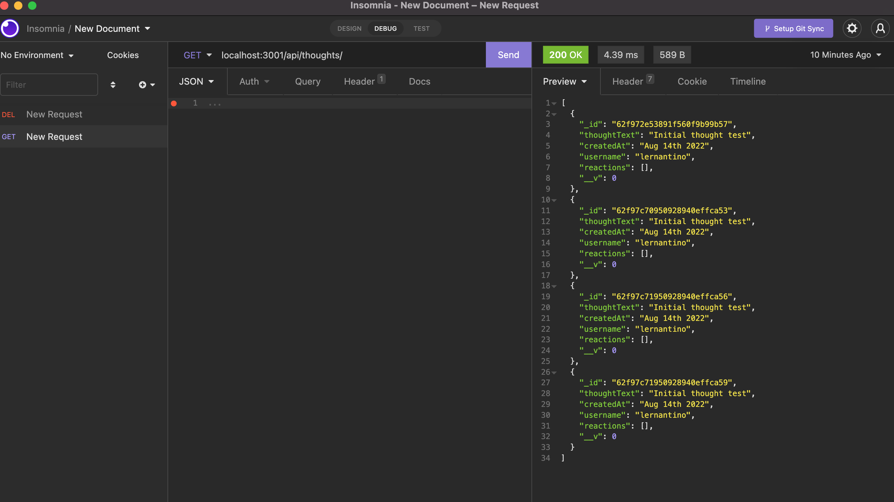
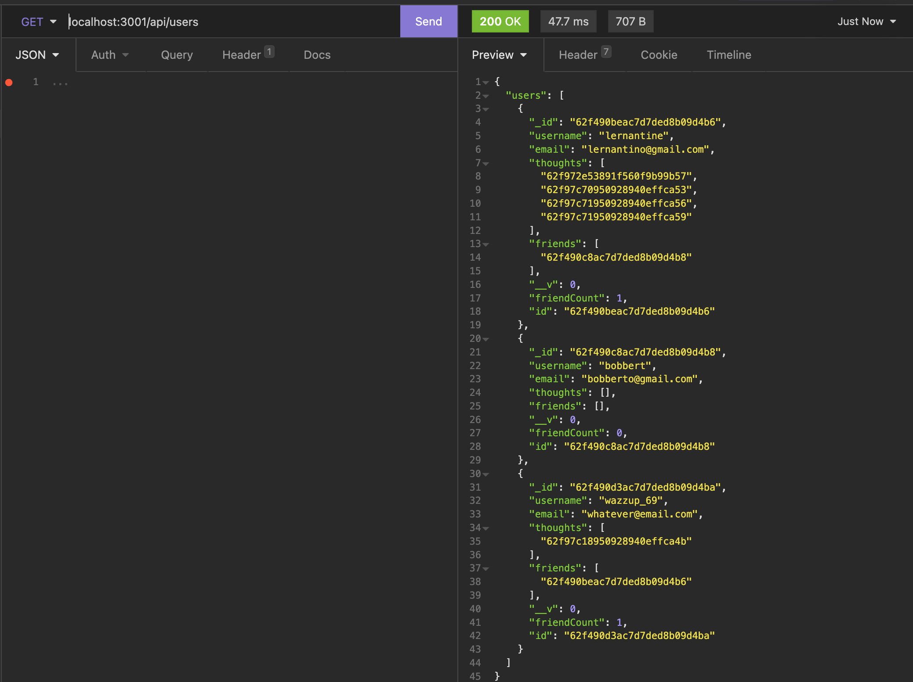

# Social Network API

   [](https://opensource.org/licenses/MIT)

  ## Description
  This is a backend API utilizing NoSQL - MongoDB and Mongoose - as a node/express server. It showcases an API that can be tested through Insomia to execute CRUD operations with Mongoose. The exercise involves a social media type implementation, tracking users, thoughts (posts) and reactions (reactions to the thoughts). These can all be added, deleted, modified, and viewed with standard CRUD operations.

  * * * * * *


  ## Table of Contents
  1. [Description](#Description)
  2. [Installation](#Installation)
  3. [Usage](#Usage)
  4. [Questions](#questions)
  5. [License](#License)

  * * * * * *

  <a name="Installation"></a>
  ## Installation
  Run "npm i" then "npm start" to run your server

  <a name="Usage"></a>
  ## Usage
  Once the server is running, utilize Insomnia to execute CRUD operations on localhost:3001/api/users, /api/users/userId, api/thoughts, /api/thoughts/thoughtId, and others. Please see the controllers/*Controller.js for routes.

  # [Follow this for a video demo](https://drive.google.com/file/d/1NW0IM0sAkqql_H2ImXU2qrpvGNux2BPx/view)

  

  * * * * * *

  

  * * * * * *

  <a name="questions"></a>
  ## Questions
  For any questions, contact me at dev@chicken1991.anonaddy.com and [visit my github profile](https://github.com/chicken1991).

  <a name="License"></a>
  ## License


```md
COPYRIGHT 2022 Ben Pitroff
Permission is hereby granted, free of charge, to any person obtaining a copy of this software and associated documentation files (the "Software"), to deal in the Software without restriction, including without limitation the rights to use, copy, modify, merge, publish, distribute, sublicense, and/or sell copies of the Software, and to permit persons to whom the Software is furnished to do so, subject to the following conditions:

The above copyright notice and this permission notice shall be included in all copies or substantial portions of the Software.

THE SOFTWARE IS PROVIDED "AS IS", WITHOUT WARRANTY OF ANY KIND, EXPRESS OR IMPLIED, INCLUDING BUT NOT LIMITED TO THE WARRANTIES OF MERCHANTABILITY, FITNESS FOR A PARTICULAR PURPOSE AND NONINFRINGEMENT. IN NO EVENT SHALL THE AUTHORS OR COPYRIGHT HOLDERS BE LIABLE FOR ANY CLAIM, DAMAGES OR OTHER LIABILITY, WHETHER IN AN ACTION OF CONTRACT, TORT OR OTHERWISE, ARISING FROM, OUT OF OR IN CONNECTION WITH THE SOFTWARE OR THE USE OR OTHER DEALINGS IN THE SOFTWARE.
```        


[License: MIT](https://opensource.org/licenses/MIT)
